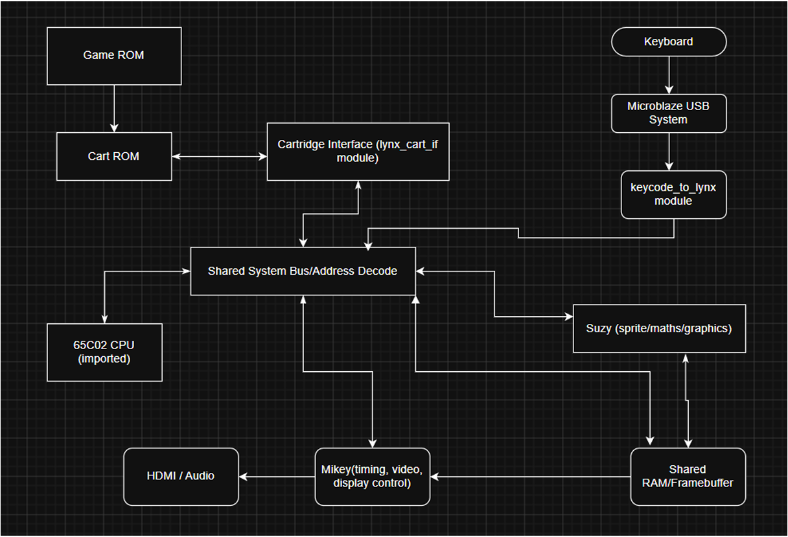

# Atari Lynx Emulator on Vivado

## Introduction

This project is an FPGA-based Atari Lynx emulator built in Vivado. The design recreates the main Lynx system around a 65C02 CPU core, custom Mikey and Suzy hardware modules, BRAM-based BIOS and cartridge memory, HDMI video output, PWM audio output, and USB keyboard controls.

The goal of the project was to make real Atari Lynx games run on FPGA hardware rather than only simulate isolated modules. The system boots through a Lynx BIOS image, reads game cartridge data from initialized BRAM, maps CPU accesses through the Lynx memory map, renders sprite/framebuffer data through Suzy and Mikey, and displays the final output over HDMI.

The design was implemented and tested on the RealDigital Urbana FPGA board, which uses an AMD/Xilinx Spartan-7 XC7S50 FPGA.

The implementation is not a perfect commercial emulator, but it demonstrates a working FPGA recreation of the core Lynx hardware path. Several games were able to boot and run, while remaining limitations include framebuffer timing artifacts, incomplete stretch behavior, and BRAM limits for larger cartridge images.

## Project Overview

The emulator is organized around three main Lynx hardware areas:

- 65C02 CPU core: runs BIOS/game code and controls the system through memory-mapped reads and writes.

- Mikey: handles display timing, framebuffer reads, palette/RGB output, audio, timers, interrupts, and cartridge-control behavior.

- Suzy: handles sprite rendering, sprite-control blocks, collision-related behavior, math/register behavior, and shared RAM writes.

These blocks share RAM and memory-mapped registers to form the main emulator system. USB keyboard input is converted into Lynx controller register values, and the video path converts Lynx framebuffer output into VGA-style RGB signals that are sent to HDMI.

## Module Hierarchy

## High-Level System Flow

USB Keyboard -> MicroBlaze USB block -> keycode_to_lynx -> Lynx FCB0/FCB1 inputs

65C02 CPU -> CPU bus bridge -> address decode -> RAM / BIOS / cartridge / Mikey / Suzy

Suzy -> sprite decoding -> framebuffer writes

Mikey -> framebuffer reads -> palette lookup -> RGB video / audio PWM / IRQ timing

lynx_display_top -> VGA-style video -> hdmi_tx_0 -> HDMI TMDS output

---

## Module Descriptions

### mb_usb_hdmi_top (topdisplaywrapper.sv)

mb_usb_hdmi_top is the board-level FPGA wrapper for the project. It connects the external clock/reset, USB keyboard interface, HDMI output, audio pins, debug hex displays, and the main Lynx emulator system.

1. Uses clk_wiz_0 to generate the 25 MHz Lynx/video clock and the 125 MHz HDMI serialization clock.

2. Uses mb_block_wrapper to receive USB keyboard keycodes and displays them on the FPGA hex displays for debugging.

3. Connects keycode_to_lynx, lynx_display_top, and hdmi_tx_0 so controller input, Lynx video/audio, and HDMI output all meet at the top level.

4. Sends the final HDMI TMDS signals to the board output pins and passes Lynx audio output to SPKL and SPKR.

---

### keycode_to_lynx (keycode_to_lynx.sv)

keycode_to_lynx converts USB HID keyboard data into Atari Lynx controller and switch inputs. It reads the keycode bytes from the MicroBlaze USB block and generates the Lynx input register values used by the core.

1. Searches all eight USB keycode bytes using has_key().

2. Maps arrow keys and keypad keys to Lynx direction bits.

3. Maps Z/A to Inside, X/B to Outside, Enter to Option 1, and Space to Pause.

4. Outputs lynx_fcb0_joystick for joystick/button state and lynx_fcb1_switches for switch/pause state.

---

### lynx_display_top (display_top_mikey.sv)

lynx_display_top connects the CPU, Lynx core, controller input, audio output, and VGA/HDMI display path. It acts as the main wrapper around the emulator core after the board-level module.

1. Uses vga_controller to generate screen position and video timing signals such as drawX, drawY, hs, vs, and active_nblank.

2. Connects the CPU to lynx_core_top through cpu_wrapper and lynx_cpu_bus_bridge.

3. Scales the VGA-style screen coordinates down to the Lynx LCD area before reading display pixels.

4. Uses lcd_fb0 and lcd_fb1 as double framebuffers before sending RGB output to the HDMI path.

---

### lynx_core_top (lynx_core.sv)

lynx_core_top is the main Atari Lynx system integration module. It connects the CPU bus to RAM, BIOS ROM, cartridge ROM, the cartridge interface, Mikey, Suzy, vector space, and MAPCTL-controlled address decoding.

1. Uses lynx_addr_decode and MAPCTL to route CPU reads and writes to the correct hardware block.

2. Instantiates lynx_ram_64k, lynx_bios_rom, lynx_cart_rom, and lynx_cart_if for the memory and cartridge path.

3. Instantiates mikey and suzy, then sends their video, audio, interrupt, stall, and debug signals back to the display wrapper.

4. Passes controller input into the core so games can read Lynx button/switch state through the mapped input registers.

---

### lynx_cpu_bus_bridge (lynx_bus_cpu.sv)

lynx_cpu_bus_bridge converts the imported CPU core’s bus request interface into the simpler core bus interface used by lynx_core_top. It latches CPU requests, generates core read/write cycles, waits for returned data, and signals when the cycle is complete.

1. Latches CPU request type, address, and write data when cpu_bus_request is active.

2. Generates core_cpu_cs, core_cpu_we, core_cpu_addr, and core_cpu_wdata for the Lynx core bus.

3. Adds wait states for reads, including extra wait states for cartridge reads at FCB2 and FCB3.

4. Holds completion while dma_stall is active so CPU bus activity can pause during shared-memory use.

---

### lynx_addr_decode (lynx_adr_decode.sv)

lynx_addr_decode decides which Lynx hardware block responds to each CPU address. It uses cpu_addr and mapctl to select between RAM, Suzy, Mikey, BIOS/vector space, and MAPCTL.

1. Detects the Suzy, Mikey, BIOS, and vector address ranges.

2. Uses mapctl[0], mapctl[1], mapctl[2], and mapctl[3] to control whether those ranges select hardware, BIOS/vector behavior, or RAM.

3. Outputs select signals such as sel_ram, sel_suzy, sel_mikey, sel_bios, sel_mapctl, and sel_vector for lynx_core_top.

4. Sends unmapped CPU addresses to RAM by default, making RAM the fallback memory region.

---

### lynx_ram_64k (lynx_ram_64k.sv)

lynx_ram_64k is the shared 64 KB RAM module for the Lynx system. It wraps the blk_mem_gen_0 BRAM IP and connects memory access for the CPU, Suzy, and Mikey video path.

1. Gives the CPU read/write access to RAM through cpu_en, cpu_addr, cpu_din, cpu_we, and cpu_dout.

2. Allows Suzy to read sprite/control data and write rendered sprite pixels through the shared RAM port.

3. Gives CPU access priority on the shared RAM port before Suzy writes or Suzy reads.

4. Uses the second BRAM port as a read-only video path so Mikey can fetch framebuffer bytes using video_addr.

---

### lynx_bios_rom (lynx_bios_rom.sv)

lynx_bios_rom is a small BIOS ROM wrapper used by the Lynx core. It connects the clock and BIOS address input to the bios_rom BRAM/IP block and returns the selected 8-bit BIOS data byte on data.

1. Instantiates bios_rom and exposes it through a simple clk, addr, and data interface for BIOS-mapped reads.

---

### lynx_cart_rom (lynx_cart.sv)

lynx_cart_rom is the cartridge ROM wrapper for the Lynx core. It connects the cartridge address path to the blk_mem_gen_1 BRAM/IP block and returns the selected 8-bit game ROM data byte on data.

1. Uses CART_ROM_ADDR_BITS to choose how many low address bits are sent into the cartridge BRAM.

2. Takes a 21-bit cartridge address input, but passes only addr[CART_ROM_ADDR_BITS-1:0] to blk_mem_gen_1.

3. Returns the selected cartridge ROM byte through data for the cartridge interface and CPU read path.

---

### lynx_cart_if (lynx_cart.sv)

lynx_cart_if implements the cartridge register interface used by the Lynx core. It stores cartridge-control register values, shifts in the selected cartridge block, builds the cartridge ROM address, and returns game ROM data for cartridge reads.

1. Stores CPU-written cartridge control values in sysctl1_reg, iodir_reg, and iodat_reg.

2. Uses the cartridge strobe on sysctl1_reg[0] and serial data from iodat_reg[1] to shift in the selected cartridge block.

3. Builds cart_rom_addr from the selected cartridge block and ripple-counter offset, with BLOCK_OFFSET_BITS controlling the offset width.

4. Holds the most recent cartridge ROM byte in cart_data_hold and returns it through rcart_rdata.

5. Provides debug outputs for the selected block, offset, full cartridge address, and last returned cartridge data.

---

### mikey (mikey.sv)

mikey is the top-level Mikey wrapper for the Lynx core. It connects CPU register access, display timing, framebuffer reads, palette conversion, timer/IRQ output, cartridge-control register writes, and audio PWM output into one module.

1. Instantiates mikey_regs to handle Mikey CPU-visible registers, display state, palette values, timer-linked signals, frame ticks, and irq_request.

2. Routes CPU reads between Mikey register data, audio register data, and cartridge-control register readback for SYSCTL1, IODIR, and IODAT.

3. Instantiates mikey_video to turn Mikey scan position and display register state into framebuffer addresses, pixel indices, and pixel-valid timing.

4. Instantiates lynx_palette to convert 4-bit pixel indices into 8-bit rgb_r, rgb_g, and rgb_b video output.

5. Instantiates mikey_audio to handle the audio register range and produce left/right PWM audio outputs on audio_pwm_l and audio_pwm_r.

---

### mikey_regs (mikey_regs.sv)

mikey_regs implements the main CPU-visible Mikey register block. It stores display-control state, palette registers, interrupt flags, timer registers, scan timing state, and frame/display status signals used by the Mikey video and audio paths.

1. Handles CPU reads and writes for Mikey registers such as interrupt control, display control, display address backup, test registers, timer registers, and palette registers.

2. Implements eight Mikey timers using backup, control, counter, and status registers, with timer underflow pulses used for interrupts, display line timing, and the Timer 7 audio link tick.

3. Generates display timing state, including visible/vblank status, current display line, frame ticks, display-address latch pulses, and Mikey scan coordinates.

4. Stores the 16-entry Lynx palette using green and blue/red register arrays, then outputs separated green, red, and blue nibble values for lynx_palette.

5. Produces irq_request from the active interrupt flags and exposes timing/register outputs such as dispctl, disp_addr, mikey_scan_x, mikey_scan_y, and mikey_scan_active for the rest of the Mikey pipeline.

---

### mikey_video (mikey_video.sv)

mikey_video implements the Mikey framebuffer read path. It takes Mikey scan coordinates, display-control state, and the current display base address, then calculates the RAM address for the current pixel and converts the fetched framebuffer byte into a 4-bit pixel index.

1. Uses dispctl bits to control video DMA enable, flip mode, 4-bit/2-bit pixel mode, and color-mode debug state.

2. Aligns disp_addr and calculates video_addr from the current mikey_scan_x, mikey_scan_y, display base address, pixel format, and flip direction.

3. Supports both 4bpp and 2bpp framebuffer formats by selecting the correct nibble or bit pair from video_data.

4. Uses a small request pipeline so the pixel coordinates and display-control state stay aligned with the delayed BRAM read data.

5. Outputs pix_index, pix_valid, pix_x, and pix_y for the palette/video output path, along with debug signals for the fetched byte and pixel state.

---

### lynx_palette (lynx_palette.sv)

lynx_palette converts a 4-bit pixel index from the Mikey video path into RGB color output. It uses the current 16-entry red, green, and blue palette arrays, expands each 4-bit color nibble to the configured RGB output width, and marks the RGB output valid when the input pixel is valid.

1. Uses pix_index to select the matching red, green, and blue palette nibbles from the 16-entry palette arrays.

2. Expands each 4-bit color value into RGB_BITS-wide RGB output using expand_4_to_rgb_bits().

3. Outputs rgb_r, rgb_g, rgb_b, and rgb_valid for the final video path.

4. Provides debug outputs for the selected pixel index, valid state, and raw red/green/blue palette nibbles.

---

### mikey_audio (mikey_audio.sv)

mikey_audio implements the Mikey audio path for the Lynx core. It handles CPU-visible audio registers, four audio channels, timer-linked channel updates, polynomial feedback behavior, stereo enable/disable control, mixed left/right samples, and PWM audio output.

1. Implements four audio channels with volume, feedback, output, backup, control, counter, and shift-register state.

2. Handles CPU reads and writes for the audio register range 0x20 through 0x3F, plus the MSTEREO register at 0x50.

3. Uses divider timing or linked timer/channel underflow pulses to update each channel depending on the channel control bits.

4. Mixes the enabled channel outputs into signed left and right audio samples, with stereo_disable controlling which channels are muted on each side.

5. Converts the mixed left/right samples into PWM outputs on pwm_l and pwm_r, while also exposing sample_l and sample_r for debug or higher-level audio use.

---

### suzy (suzy.sv)

suzy is the top-level Suzy wrapper for the Lynx core. It connects CPU-visible Suzy registers, controller input readback, SCB fetching, sprite decoding, shared RAM access, sprite-render status, collision status, and debug outputs into one module.

1. Instantiates suzy_regs to handle CPU reads/writes, Suzy register state, controller inputs, start/stop pulses, busy/done status, and collision sticky status.

2. Fetches Sprite Control Block data from RAM, stores the decoded SCB fields, and follows the SCB chain until it reaches the end marker.

3. Loads or reuses SCB palette data, reloadable size/stretch/tilt fields, sprite position, sprite data pointer, and next-SCB pointer before starting the decoder.

4. Instantiates suzy_decoder to process the decoded sprite data and generate shared RAM reads/writes for rendered sprite pixels.

5. Provides debug outputs for SCB fetch/decode state, sprite control values, sprite position/size, framebuffer writes, collision state, and selected Suzy register behavior.

---

### suzy_regs (suzy_reg.sv)

suzy_regs implements the CPU-visible Suzy register block. It stores Suzy register values, exposes sprite-control and framebuffer address fields, handles controller input readback, starts or stops sprite rendering, tracks Suzy busy/done/collision status, and includes the math register behavior used by the core.

1. Stores the Suzy register file in regs[0:255] and maps important register pairs into outputs such as hoff, voff, vid_base_addr, coll_base_addr, scb_next_addr, sprite size, and offset values.

2. Handles CPU reads for Suzy hardware revision, SPRINIT, SPRGO, SPRSYS, joystick input, switch input, cartridge idle reads, and normal register-file values.

3. Generates start_pulse when SPRGO is written while Suzy is initialized, and generates force_stop_pulse when the CPU clears SPRGO.

4. Tracks suzy_busy, suzy_done_sticky, and collision_sticky using frame-done and collision signals from the Suzy rendering core.

5. Implements Suzy math behavior for multiply/divide register writes, including math busy timing, accumulator behavior, division result/remainder storage, and mathbit status.

---

### suzy_decoder (suzy_packet_decode.sv)

suzy_decoder is the main Suzy sprite rendering pipeline. It receives decoded sprite-control information from suzy, reads compressed sprite line data from RAM, uses the packet decoder and geometry logic to produce screen pixels, and writes rendered sprite pixels back into the shared framebuffer.

1. Latches sprite settings such as framebuffer base address, collision base address, SCB address, offsets, sprite position, size, stretch, tilt, control bits, and palette values when start is asserted.

2. Reads sprite line data from RAM, stores each line in an internal line buffer, and passes the packed line data into suzy_packet_decoder.

3. Uses scb_palette to map source pen values through the sprite palette and suzy_geometry to convert sprite pixel coordinates into screen position and framebuffer address.

4. Performs read-modify-write framebuffer updates so each rendered pixel modifies the correct nibble inside the target framebuffer byte.

5. Handles collision-buffer reads/writes, collision detection, collision depository writes, and exposes debug signals for the last framebuffer write and rendered pixel count.

---

### scb_palette (scb_palette.sv)

scb_palette maps a 4-bit source pen value from the sprite packet decoder into the final 4-bit display pen used by the Suzy sprite renderer. It uses eight SCB palette bytes, where each byte contains two 4-bit palette entries.

1. Takes src_pen from the sprite decode path and selects the matching nibble from pal0 through pal7.

2. Maps source pens 0x0 through 0xF into mapped_pen, with the high and low nibbles of each palette byte representing two palette entries.

3. Outputs the final mapped_pen value used by suzy_decoder for framebuffer writes and collision-related sprite behavior.

---

### suzy_geometry (suzy_geometry.sv)

suzy_geometry converts Suzy sprite pixel coordinates into framebuffer coordinates. It applies sprite position, horizontal/vertical offsets, draw direction, and screen bounds to decide whether a pixel is visible and where it should be written in the Lynx framebuffer.

1. Computes world-space pixel position from hpos, vpos, out_x, out_y, draw_left, and draw_up.

2. Converts world position into screen position by subtracting hoff and voff.

3. Checks whether the pixel is inside the 160x102 Lynx visible display area using visible.

4. Calculates the framebuffer byte address from vid_base_addr, screen row, and half-width pixel packing.

5. Outputs pixel_is_odd so the sprite renderer knows whether the pixel belongs in the high or low nibble of the framebuffer byte.

---

### cpu_wrapper / cpu_flat_wrapper (cpu_wrapper.sv, cpu_flat_wrapper.vhd)

cpu_wrapper and cpu_flat_wrapper connect the imported VHDL CPU core to the SystemVerilog Lynx system. The VHDL wrapper instantiates the imported CPU and exposes its bus, interrupt, sleep, savestate, and debug signals, while the SystemVerilog wrapper gives the rest of the project a clean SV-friendly CPU module interface.

1. cpu_flat_wrapper instantiates the imported VHDL cpu entity and connects its clock, reset, DMA/sleep control, bus request interface, interrupt signals, and savestate inputs.

2. Converts the CPU bus address and exported debug record fields into simple std_logic_vector outputs such as bus_addr, dbg_PC, dbg_RegA, dbg_RegX, dbg_RegY, and status flags.

3. cpu_wrapper instantiates cpu_flat_wrapper from SystemVerilog so lynx_display_top can connect to the CPU using normal logic signals.

4. Exposes the CPU memory bus signals bus_request, bus_rnw, bus_addr, bus_datawrite, bus_dataread, and bus_done, which are later connected to lynx_cpu_bus_bridge.

5. Provides debug outputs for CPU registers, flags, sleep state, IRQ state, and the last opcode byte, which helped trace CPU execution during testing.

---

### Imported CPU core files from MisterFPGA 

These are the imported VHDL CPU source files used by cpu_flat_wrapper to provide the 65C02-style CPU core during development. They are not redistributed in this public repository.

---

### vga_controller (VGA_controller.sv)

This module uses horizontal and vertical counters to generate the current

pixel coordinates and produce the hs and vs timing signals required for a 640×480 display.

It also generates the active_nblank signal to indicate whether the current pixel is inside the

visible display region, while sync is provided as a constant unused composite sync signal.

---

### hdmi_tx_0

HDMI transmitter IP that converts VGA-style RGB, sync, and video-enable signals into HDMI TMDS output.

---

### clk_wiz_0

Clocking IP that generates the 25 MHz Lynx/video clock and 125 MHz HDMI serialization clock.

---

### HexDriver and nibble_to_hex (hex_driver.sv)

The module converts four 4-bit inputs into their corresponding hex display

patterns and rapidly multiplexes between them so all digits appear lit simultaneously. We

used it as a debugger to view if keycodes are being received by the FPGA.

---

### mb_block_wrapper

Vivado-generated wrapper around the MicroBlaze USB block design. It exposes USB, UART, reset, clock, and keycode ports to the top-level module.

---

## Coe game files

Cartridge .coe files were used during development to initialize the cartridge BRAM in Vivado, but commercial-game cartridge .coe files are not included in this public repository.

---

## Resource Usage

Resource usage from Vivado with a cartridge image loaded into BRAM:

| Resource | Usage |
|---|---:|
| LUT | 22921 |
| DSP | 4 |
| BRAM | 64.50 |
| Flip-Flop | 9396 |
| Latches | 0 |
| Frequency | 22.933 MHz |
| Static Power | 0.078 W |
| Dynamic Power | 0.439 W |
| Total Power | 0.517 W |

WNS is -33.605 ns and the design frequency is 22.933 MHz.

---

## Known Limitations / Future Improvements

- Some framebuffer timing issues can appear visually even when games run logically.

- CPU and Suzy can both access shared RAM; improved Suzy CPU-stall/sleep behavior could reduce visual artifacts.

- Stretch behavior was not fully implemented because of time constraints.

- Game ROM size is limited by available FPGA BRAM because each game coe file has to be loaded into the BRAM before programming the FPGA.

---

## Files Not Included

This public repository is a sanitized version of the original FPGA Atari Lynx emulator project.

Atari Lynx BIOS files, commercial game ROMs, cartridge .coe files, bitstreams containing ROM data, MicroBlaze firmware .elf files generated for the hardware build, and imported third-party CPU source files are not included.

The original project used CPU source files from the MiSTer FPGA Atari Lynx project during development. Those files are not redistributed here.

MiSTer FPGA Atari Lynx project:  
https://github.com/MiSTer-devel/AtariLynx_MiSTer

MiSTer CPU-related files used during development but not included here:

- rtl/cpu.vhd
- rtl/bus_savestates.vhd
- rtl/reg_savestates.vhd
- rtl/export.vhd, using only the pexport package/type definitions

The simulation-only export entity from rtl/export.vhd was not used for the FPGA hardware build.

Users must provide their own legally obtained BIOS and cartridge images to rebuild or test the full system.

---

## External Resources

- Imported Atari Lynx CPU core from the MiSTer FPGA Atari Lynx project:

  https://github.com/MiSTer-devel/AtariLynx_MiSTer

- Atari Lynx hardware documentation reference:

  https://www.monlynx.de/lynx/lynxdoc.html

- Course support files were used for the VGA controller, HexDriver, USB keyboard C code, and MicroBlaze USB input system. Original headers and credits are kept in the source files.

- MicroBlaze firmware ELF files generated from cartridge/COE data are not included in this public repository.

- AI-generated testbenches were used to help debug multiple design paths. AI was also used during development to help generate cartridge memory initialization files, but generated cartridge files are not included in this public repository.

- RealDigital Urbana FPGA board used for hardware testing:  
  https://www.amd.com/en/corporate/university-program/aup-boards/realdigital-urbana-board.html

---

## Project Contributors

- Akshan Mohaney

- Mayank Narayan
